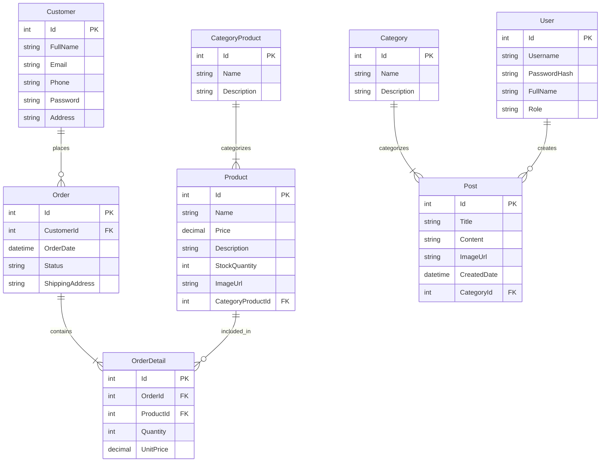

# BÁO CÁO MÔN HỌC
## Đề tài: Cửa hàng bán phụ kiện Thú Cưng (Pet Shop)

---

### MỤC LỤC
1. [Chương 1: Giới thiệu đề tài](#chuong-1)
2. [Chương 2: Cơ sở lý thuyết](#chuong-2)
3. [Chương 3: Phân tích thiết kế hệ thống](#chuong-3)
4. [Chương 4: Xây dựng hệ thống](#chuong-4)
5. [Chương 5: Hướng dẫn sử dụng & Chụp ảnh minh chứng kết quả](#chuong-5)
6. [Chương 6: Kết luận và hướng phát triển](#chuong-6)

---

###  Chương 1: Giới thiệu đề tài

**1. Lý do chọn đề tài**
Thị trường chăm sóc thú cưng đang phát triển mạnh mẽ. Nhu cầu về các sản phẩm phụ kiện cho thú cưng như thức ăn hạt, đồ chơi, quần áo, nhà cây... ngày càng tăng. Đề tài "Cửa hàng bán phụ kiện Thú Cưng" được chọn để đáp ứng nhu cầu này thông qua một nền tảng thương mại điện tử hiện đại.

**2. Mục tiêu đề tài**
- Xây dựng hệ thống thương mại điện tử hoàn chỉnh theo mô hình 3 lớp.
- Cung cấp giao diện quản trị (Admin) dành cho người bán và giao diện mua sắm (Frontend) thân thiện dành cho khách hàng.
- Tích hợp các chức năng: Xem sản phẩm, Lọc theo giá, Tin tức (Blog), Giỏ hàng và Thanh toán.

---

###  Chương 2: Cơ sở lý thuyết

**1. Mô hình 3 lớp (3-Tier Architecture)**
Hệ thống được thiết kế dựa trên mô hình 3 lớp:
- **Presentation Layer (Frontend/View):** Giao diện người dùng sử dụng ReactJS và ASP.NET MVC Views.
- **Business Logic Layer (Backend/Controllers):** ASP.NET Core Web API xử lý logic nghiệp vụ, tính toán giỏ hàng, xác thực.
- **Data Access Layer (Data/Database):** Entity Framework Core kết nối với SQL Server, xử lý lưu trữ.

**2. Công nghệ sử dụng**
- **Backend:** ASP.NET Core 8.0, Entity Framework Core.
- **Frontend:** ReactJS, Bootstrap, Axios.
- **Database:** Microsoft SQL Server.
- **Bảo mật:** JWT Auth (tùy chọn), BCrypt (mã hóa mật khẩu).
- **Công cụ hỗ trợ:** CKEditor 5 (soạn thảo văn bản), Swagger (tài liệu API).

---

###  Chương 3: Phân tích thiết kế hệ thống

**1. Sơ đồ thực thể liên kết (ERD)**

**2. Danh sách API (API Specifications)**

| Method | Endpoint | Description |
|---|---|---|
| GET | `/api/Products` | Lấy danh sách toàn bộ sản phẩm (có phân trang) |
| GET | `/api/Products/{id}` | Lấy chi tiết sản phẩm |
| GET | `/api/Products/category/{id}` | Lấy sản phẩm theo danh mục |
| GET | `/api/Posts` | Lấy danh sách bài viết (tin tức/blog) |
| GET | `/api/Posts/{id}` | Lấy chi tiết bài viết |
| POST | `/api/CustomersApi` | Đăng ký tài khoản khách hàng mới |
| POST | `/api/OrdersApi/checkout` | Xử lý thanh toán đơn hàng |

---

###  Chương 4: Xây dựng hệ thống

**1. Cấu trúc Solution**
Hệ thống được chia thành 3 dự án chính:
- `CMS.Data`: Chứa các Model (Entities) và `ApplicationDbContext`.
- `CMS.Backend`: Chứa Controllers, API, Middleware và giao diện quản trị Admin.
- `cms.frontend`: Chứa ứng dụng ReactJS.

**2. Database Script & Seed Data**
Database được khởi tạo bằng công cụ `dotnet ef migrations script`. Dữ liệu mẫu (Seed Data) đã được nạp sẵn để đảm bảo có thể hiển thị UI khi vừa chạy ứng dụng. Cấu hình chuỗi kết nối nằm tại `appsettings.json`.

**3. Mã hóa & Bảo mật**
- Sử dụng thư viện `BCrypt.Net-Next` để mã hóa mật khẩu người quản trị và khách hàng trước khi lưu vào CSDL.
- Ẩn trường thông tin nhạy cảm (như `Password`) khỏi các API GET trả về cho Frontend.

---

###  Chương 5: Hướng dẫn sử dụng & Chụp ảnh minh chứng kết quả

*(Sinh viên tự chèn hình ảnh chụp màn hình vào file Word)*

**1. Khởi động Backend (F5 / dotnet run)**
- Mở Solution trong Visual Studio hoặc VS Code.
- Cấu hình chuỗi kết nối CSDL tại `CMS.Backend/appsettings.json`.
- Truy cập vào trang Swagger UI để kiểm thử API: `https://localhost:7083/swagger`.
- Đăng nhập vào trang Quản trị viên: `https://localhost:7083/Account/Login`.

**2. Khởi động Frontend (npm start)**
- Chuyển thư mục vào `cms.frontend`.
- Khai báo file môi trường `.env` với các URL cấu hình.
- Chạy lệnh `npm start`.
- Truy cập cửa hàng tại `http://localhost:3000`.

**3. Các tính năng chính (Minh chứng)**
- **Giao diện người dùng:** Trang chủ hiển thị banner, danh sách sản phẩm, tin tức nổi bật.
- **Tính năng Lọc:** Lọc sản phẩm theo khoảng giá trong trang Shop.
- **Trình soạn thảo:** Sử dụng CKEditor để viết bài đăng tin tức, tích hợp chức năng Upload ảnh.
- **Giỏ hàng & Thanh toán:** Hiển thị Badge giỏ hàng, cập nhật tổng tiền và xử lý Checkout qua API.

---

###  Chương 6: Kết luận và hướng phát triển

**1. Kết quả đạt được**
- Xây dựng thành công ứng dụng thương mại điện tử đúng kiến trúc 3 lớp với quy mô 8 bảng dữ liệu.
- Hoàn thiện đầy đủ API cho Frontend ReactJS.
- Triển khai thành công các kỹ thuật bảo mật cơ bản như Hashing Password và Authentication.

**2. Hướng phát triển**
- Tích hợp thêm tính năng thanh toán trực tuyến (VNPAY, Momo).
- Áp dụng hệ thống Caching (Redis) để tăng tốc độ tải sản phẩm.
- Mở rộng thêm tính năng quản lý khuyến mãi, mã giảm giá (Voucher) cho cửa hàng.
